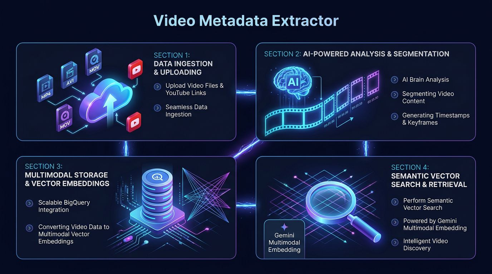

# 🎬 Video Metadata Extractor

An advanced AI-powered insights engine to **analyze**, **extract rich metadata**, and **semantically search** video scenes sequentially leveraging Gemini and Google Cloud architectures.

---
<div align="center">



</div>

## Overview

This repository provides an advanced video metadata extraction pipeline via a NextJS frontend and a scalable FastAPI backend.

### Key Features
- **Video Analysis & Scene Extraction**: Automatically break down uploaded videos into specific scenes (e.g., Hooks, Action, Comedic Beats) extracting timestamps, summaries, and edits using Gemini 2.5 or 3.1 Pro.
- **YouTube & Local Video Support**: Upload local `mp4` or `mov` files directly to Google Cloud Storage or paste YouTube links for seamless analysis.
- **Multimodal Prompt & Video Library**: Upload videos along with specific behavioral prompts to BigQuery. Easily search this library using text or image queries leveraging Gemini 2 Multimodal Vector Embeddings.
- **Semantic Vector Search**: Native integration with BigQuery `VECTOR_SEARCH` (with an automatic local SQLite cosine similarity fallback) to instantly find specific scenes across your video catalog.
- **Modern NextJS Dashboard**: Fully-responsive interface with dynamic Light/Dark mode toggling, statistical metadata insights, asset library management, and comprehensive search portals.
- **Scalable FastAPI Backend**: Concurrent background task processing tailored for Cloud Run deployments and frictionless Google Cloud integrations.

---
## 🚀 Use Cases & Applications

By transforming unstructured video files into semantically searchable databases, this tool unlocks powerful capabilities across the media space:

*   **✂️ Automated Short-Form Repurposing:** Instantly locate "Hooks" and "Comedic Beats" in long-form content to rapidly generate clips for TikTok, Reels, or Shorts.
*   **🎬 Smart Trailer Generation:** Query your massive video catalog for specific action sequences, emotional beats, or visual aesthetics without manual scrubbing.
*   **🗄️ Instant Archival Retrieval:** Use semantic text or image search to instantly find exact B-roll moments (e.g., "crowd cheering in the rain") for news and documentary production.
*   **🎯 Contextual Ad Insertion:** Analyze scene moods and summaries to dynamically place context-aware advertisements (e.g., avoiding upbeat ads after a tragic scene).
*   **⚽ Sports Highlight Reels:** Feed behavioral prompts to instantly extract key plays and compile highlight reels across hours of multi-camera game feeds.
*   **🛡️ Automated Content Moderation:** Automatically flag sensitive, violent, or non-compliant scenes using targeted prompts, complete with exact timestamps for rapid review.

---

## 🛠 Tech Stack

### Backend (`/backend`)
- **Framework**: FastAPI (Uvicorn concurrent hooks).
- **Core AI Wrappers**: `google-genai` leveraging Vertex AI endpoints wrapping `gemini-2.5-pro`.
- **Datalayers**: Google Cloud Storage & Standard BigQuery (manual SQLite fallbacks preserved).

### Frontend (`/frontend`)
- **Framework**: Next.js 14+ layouts (TypeScript, Client actions).
- **Styling tokens**: Standard Tailwind framework mapping seamless Dark/Light Support triggers.

---

## ⚙️ Local Setup

Login to GCP project using gcloud command from your local setup:
```bash
gcloud auth login
gcloud config set project <PROJECT_ID>
gcloud auth application-default login
```

### 1. Config Environment
Create a `.env` file in the root mirroring `.env.example`:

```env
GCP_PROJECT_ID=your-project-id
GCP_LOCATION=us-central1
GCS_BUCKET_NAME=your-bucket-name
BQ_DATASET_ID=metadata_dataset
BQ_TABLE_ID=metadata_table
BQ_PROMPT_TABLE_ID=prompt_video_table

GEMINI_MODEL_TEXT=gemini-3.1-pro-preview
GEMINI_MODEL_TEXT_LOCATION=us-central1
GEMINI_MODEL_EMBEDDING=gemini-embedding-2-preview
GEMINI_MODEL_EMBEDDING_LOCATION=us-central1
```

### 2. Configure & Run
You can easily setup and run all required services concurrently (Assuming GCS Bucket and BigQuery is already setup):
```bash
make start-all
```
This will automatically initialize BigQuery schemas, install requirements natively, and spin up both the FastAPI backend and NextJS frontend!
Open [http://localhost:3000](http://localhost:3000) accessing central stats dynamically maps.

---

## ☁️ Cloud Run Deployment

You can facilitate sequential infrastructure creations safely passing secure Buildpacks configurations leveraging the provided orchestrator hooks (Handles all the BiqQuery & deployment of the application):

```bash
chmod +x deploy_cloudrun.sh
./deploy_cloudrun.sh
```
Executes sequential deployments pushing remote frame bundles caching securely.

### 🔑 IAM Permission Prerequisites

To ensure the **Backend** running on Cloud Run can operate smoothly without `403 Access Denied` errors, ensure your Cloud Run service account has the following roles:
- **BigQuery Data Editor** (`roles/bigquery.dataEditor`) on the target Dataset or Project for inserting insights.
- **Vertex AI User** (`roles/aiplatform.user`) for executing Gemini 2.5 oe 3.1 Pro multimodal models.
- **Storage Object Admin** (`roles/storage.objectAdmin`) or **Storage Object User** (`roles/storage.objectUser`) on the GCS Bucket to upload and process staged videos.

By default, Cloud Run uses the **Compute Engine default service account** (`[PROJECT_NUMBER]-compute@developer.gserviceaccount.com`). You can assign these roles in the GCP IAM console under **IAM & Admin**.


---

<div align="center">

[**Sunil Kumar**](https://www.linkedin.com/in/sunilkumar88/)

<sub>A Gemini use-case demonstration. Not an official Google product.</sub>

</div>
